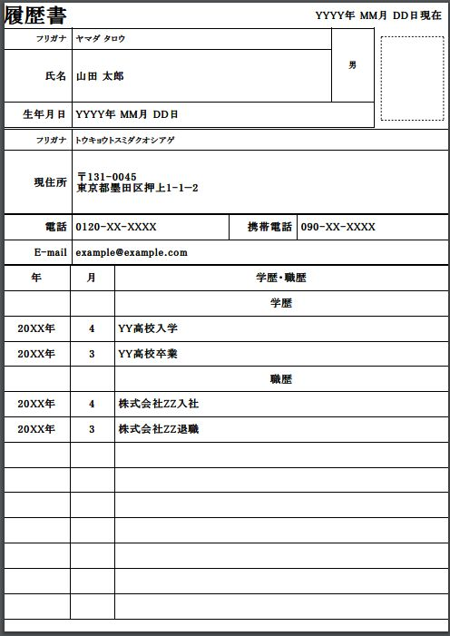
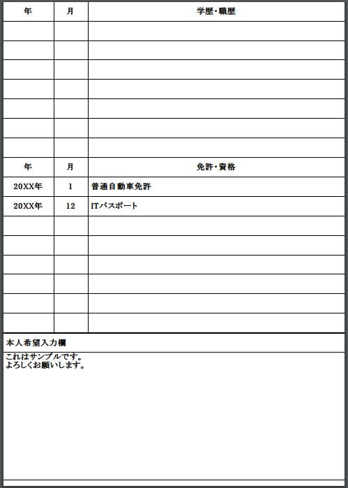

Resume Maker
===

[](https://travis-ci.com/PruneMazui/resume-maker)

## Overview

* Generate a JIS standard resume (for Japanese) from the json config file.

## Requirement

* nodejs >= 6.9.5

## Dependences

* ejs >= 2.5.8
* html-pdf >= 2.2.0

## Usage

1. Download the source code and move the directory.
2. Execute the command. `npm i`
3. Make a config file referring to file.`resume.template.json`
4. Execute the command. `npm run make-jp-resume [config file] [output pdf]`

## Example

### Config file

```json
{
    "date": "YYYY年 MM月 DD日現在",
    "name_kana": "ヤマダ タロウ",
    "name": "山田 太郎",
    "gender": "男",
    "birth_day": "YYYY年 MM月 DD日",
    "address_kana": "トウキョウトスミダクオシアゲ",
    "zip_code": "〒131-0045",
    "address": "東京都墨田区押上1-1−2",
    "tel": "0120-XX-XXXX",
    "phone": "090-XX-XXXX",
    "mail": "example@example.com",
    "academic_histories": [
        {
            "year": "20XX年",
            "month": "4",
            "value": "YY高校入学"
        },
        {
            "year": "20XX年",
            "month": "3",
            "value": "YY高校卒業"
        }
    ],
    "work_histories": [
        {
            "year": "20XX年",
            "month": "4",
            "value": "株式会社ZZ入社"
        },
        {
            "year": "20XX年",
            "month": "3",
            "value": "株式会社ZZ退職"
        }
    ],
    "licenses": [
        {
            "year": "20XX年",
            "month": "1",
            "value": "普通自動車免許"
        },
        {
            "year": "20XX年",
            "month": "12",
            "value": "ITパスポート"
        }
    ],
    "free": "これはサンプルです。\nよろしくお願いします。"
}
```
### Made PDF



